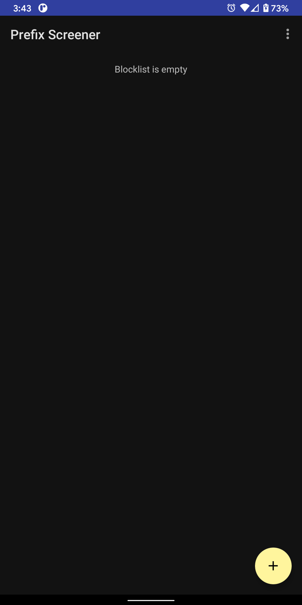
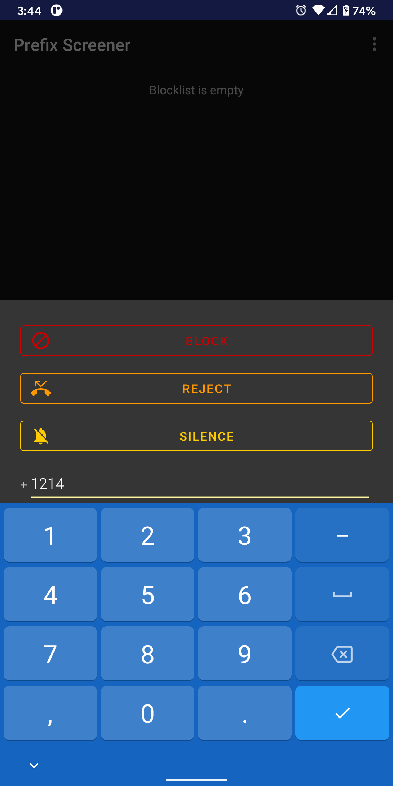

# Prefix Screener

## Usage

To add a prefix to the blocklist, press "+" on the bottom right:

Enter a prefix, including country code. The app will screen incoming calls from numbers that begin with this prefix.

Choose an action to take for incoming calls matching the newly entered prefix:

1. **Block:** Completely disallow the call.

2. **Reject:** Reject the call as if done manually by the user, allowing the caller to leave a voicemail.

3. **Silence:** Allow the call, but silence the ringer. The user will be visually notified of the incoming call.
